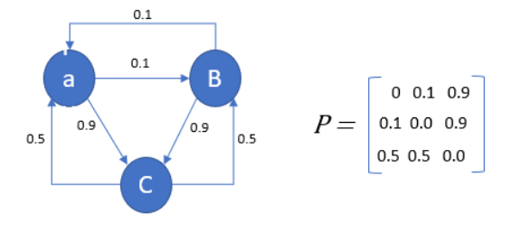

## Introduction
This repo is used to generate testing data used in ML for quick evaluation.

## Supplement
* [Markov Chain Analysis and Simulation using Python](https://towardsdatascience.com/markov-chain-analysis-and-simulation-using-python-4507cee0b06e)
> A Markov chain is a discrete-time stochastic process that progresses from one state to another with certain probabilities that can be represented by a graph and state transition matrix P as indicated below:
> 
* [Medium - A Python Library to Generate a Synthetic Time Series Data](https://towardsdatascience.com/tsbngen-a-python-library-to-generate-time-series-data-from-an-arbitrary-dynamic-bayesian-network-4b46e178cd9f)
> tsBNgen: A Python Library to Generate Time Series Data from an Arbitrary Dynamic Bayesian Network Structure
* [PyPI - time-series-generator](https://pypi.org/project/time-series-generator/)
> Emulates Teras Tensorflow TimeSeriesGenerator functionality presenting a candidate solution for the direct multi-step outputs limitation in Keras' version.
* [scikit-learn - sample-generator](https://scikit-learn.org/stable/modules/classes.html#samples-generator)
> The sklearn.datasets module includes utilities to load datasets, including methods to load and fetch popular reference datasets. It also features some artificial data generators.
* [RIP Tutorial - Pandas: Generate time series of random numbers then down sample](https://riptutorial.com/pandas/example/16702/generate-time-series-of-random-numbers-then-down-sample)
> Use Pandas API:date_range to randomly generate time series of numbers and down sample by API:resample
* [Book - Python Data Science Handbook - Working with Time Series](https://jakevdp.github.io/PythonDataScienceHandbook/03.11-working-with-time-series.html)
> Pandas was developed in the context of financial modeling, so as you might expect, it contains a fairly extensive set of tools for working with dates, times, and time-indexed data.
* [O'Reilly - Practical Time Series Analysis by Aileen Nielsen: Chapter 4. Simulating Time Series Data](https://www.oreilly.com/library/view/practical-time-series/9781492041641/ch04.html)
